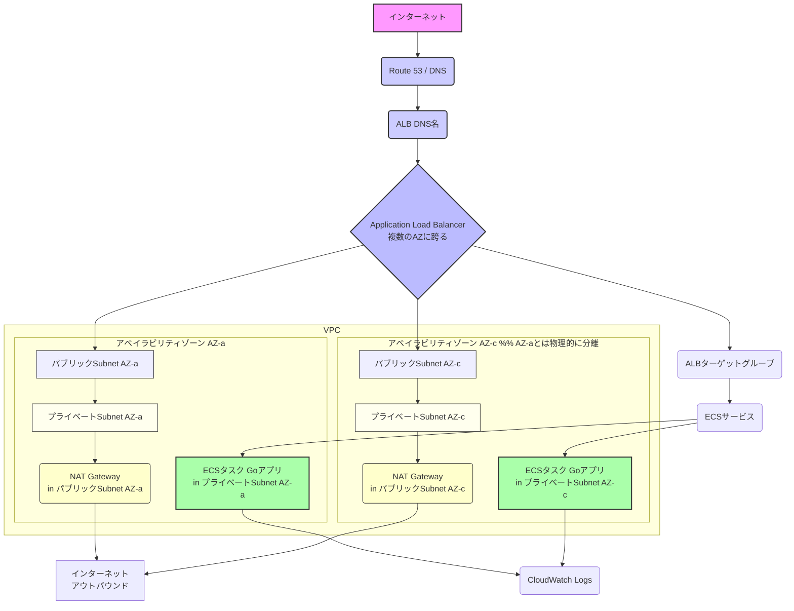

AWSでやった場合(terraform)

## terraform(infra)
- VPCの中で、「IPアドレスの範囲（サブネット）」を複数定義し、**かつ**、それぞれのサブネットを**異なるアベイラビリティゾーン (AZ)** に配置する。
  これによって、ネットワークを論理的に分割できるだけでなく、物理的に独立した複数の場所にリソースを配置できる基盤ができるのです。 そして、その異なるAZにあるサブネットに、アプリケーションのインスタンス（ECSタスクなど）を複数配置することで、**可用性の高い構成を実現する**、という流れになります。
  「IPアドレスの範囲があること」がネットワークの区画と管理を、「AZを分けること」が可用性・耐障害性のための物理的な分離を担当している、というイメージですね。
  その理解で、ECS on Fargate + Terraformでのインフラ構築を進めていただくのは、非常に良い方向性だと思います。

---
## render
https://dashboard.render.com/web/new?newUser=true

Pocではこちらを利用する
